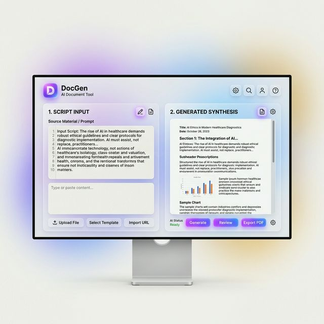

# DocGen Neural Engine 🚀

[](https://github.com/HorngKimsomnang/AI_generator/stargazers)
[](https://github.com/HorngKimsomnang/AI_generator/network/members)
[](https://github.com/HorngKimsomnang/AI_generator)

> **AI-Powered Documentation. Redefined.**



DocGen Neural Engine is a high-performance, AI-driven platform designed to transform raw source code into professional-grade technical documentation. By leveraging advanced **Few-Shot Prompting** and **Chain-of-Thought** reasoning, DocGen bridges the gap between complex logic and human-readable architecture.

---

## ✨ Key Features

### 🏛️ Senior AI Architect Engine
Uses a specialized "Senior Technical Architect" persona to ensure that documentation doesn't just describe *what* the code does, but explains the **Architectural Intent** and **Technical Trade-offs**.

### 🧠 Logic Breakdown
Automatically identifies and documents:
- **Trade-offs**: Why a specific approach (e.g., Memoization vs. Recursion) was chosen.
- **Impact**: How the logic affect the overall scalability of the application.
- **Learning Gaps**: Explanation of underlying CS principles (hashing, Big O, etc.).

### ⏱️ Complexity Analysis
Implements a strict **Chain-of-Thought** methodology to calculate Time and Space complexity ($O(n)$ notation) accurately, preventing "hallucinated" ratings.

### 🌓 Premium Experience
- **Bi-Modal UI**: Seamless switching between sleek Dark and Light modes.
- **Real-time Synthesis**: Watch as the AI "scans" and documents your logic in real-time.
- **Multi-Language Support**: Optimized for **JavaScript** and **PHP**.

---

## 🛠️ Tech Stack

### Backend
- **Node.js & Express**: High-concurrency API server.
- **Hugging Face Hub**: Leveraging `meta-llama/Llama-3.1-8B-Instruct` for heavy-duty inference.
- **Dotenv**: Secure environment management.

### Frontend
- **React 19 & Vite**: Modern, lightning-fast development environment.
- **Framer Motion**: Smooth micro-interactions and animations.
- **Lucide-React**: Premium iconography.
- **Tailwind CSS**: Utility-first styling with high-end glassmorphism components.

---

## 🚀 Getting Started

### Prerequisites
- Node.js (v18+)
- A Hugging Face API Key

### Installation

1. **Clone the repository**
   ```bash
   git clone https://github.com/HorngKimsomnang/AI_generator.git
   cd AI_generator
   ```

2. **Setup Backend**
   ```bash
   cd backend
   npm install
   # Create a .env file and add:
   # HF_API_KEY=your_huggingface_key
   # PORT=3001
   npm run dev
   ```

3. **Setup Frontend**
   ```bash
   cd ../frontend
   npm install
   npm run dev
   ```

---

## 📂 Project Structure

- `backend/`: Express server, LLM integration, and system instructions.
- `frontend/`: React components, Framer Motion animations, and theme logic.
- `docs/`: Assets and project documentation.
- `PROMPT_LIBRARY.md`: Detailed documentation of the AI prompts used in this project.

---

## 📄 License

This project is licensed under the **ISC License**.

---

Generated with ❤️ by the **DocGen Neural Engine**.
